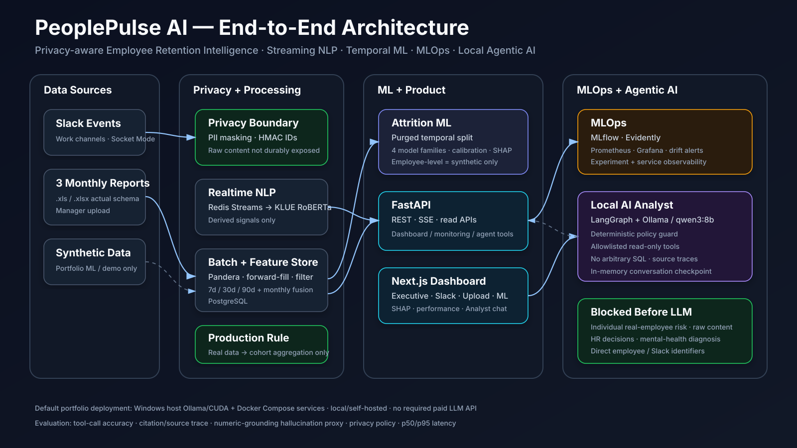

# PeoplePulse AI

**Privacy-Aware Employee Retention Intelligence Platform**
Realtime Korean workplace NLP · Feature Store · Temporal ML · Dashboard · MLOps · Local Agentic AI

> **Portfolio scope:** this repository demonstrates system design and ML/LLM engineering with synthetic data. It does not claim that the included attrition model is validated for real employment decisions.



## Why this project

People analytics can easily become invasive: raw workplace messages, browsing records and opaque risk scores can expose employees or be misused in HR decisions. PeoplePulse AI explores a different architecture:

- keep raw communication transient,
- pseudonymize identifiers before durable analytics,
- store derived workplace signals rather than Slack message text,
- keep real-data analytics at department/cohort level,
- use employee-level attrition modeling only on synthetic portfolio data,
- evaluate models with temporal leakage controls and calibration,
- monitor experiments/data drift/services,
- expose analytics to a local LLM only through fixed read-only tools,
- block individual real-employee risk, raw content, HR decisions and mental-health inference before the LLM.

## Architecture

```text
Slack ──> PII Mask/HMAC ──> Redis Streams ──> KLUE RoBERTa ──> Derived Signals ──┐
                                                                                │
3 Monthly Reports ──> Pandera/Privacy Filter ──> Monthly Features ──────────────┼─> PostgreSQL Feature Store
                                                                                │
Synthetic Data ─────────────────────────────────────────────────────────────────┘
                                      │
                                      ├─> Temporal Attrition ML ─> Calibration / SHAP
                                      ├─> FastAPI ─> Next.js Dashboard / SSE
                                      ├─> MLflow + Evidently + Prometheus/Grafana
                                      └─> Policy Guard ─> LangGraph ─> Ollama ─> Read-only Tools
```

Detailed diagram and trust boundaries: [docs/portfolio/architecture.md](docs/portfolio/architecture.md)

## What is implemented

| STEP | Capability | Main technologies |
|---|---|---|
| 1 | Local infrastructure | Docker Compose, PostgreSQL, Redis |
| 2 | Slack realtime ingestion | Slack Bolt, Events API, Socket Mode, Redis Streams |
| 3 | Korean workplace-signal NLP | PyTorch, Transformers, KLUE RoBERTa, CUDA |
| 4 | Actual-format 3-report ingestion | Pandera, pandas/calamine, FastAPI uploads |
| 5 | Identity resolution + Feature Store | HMAC identity map, SQL/Python rolling features |
| 6 | Synthetic attrition ML | scikit-learn, XGBoost, LightGBM, CatBoost, SHAP |
| 7 | Product dashboard | FastAPI, Next.js, React, ECharts, SSE |
| 8 | MLOps / drift | MLflow, Evidently, Prometheus, Grafana |
| 9 | Local Analyst Agent | Ollama, qwen3:8b, LangGraph, allowlisted tools |
| 10 | Evaluation / portfolio finalization | Agent eval harness, policy tests, one-command demo, docs |

## Quick Start

### Prerequisites

- Windows + PowerShell
- Docker Desktop
- Python 3.11 virtual environment
- Ollama
- Optional/verified GPU path: NVIDIA RTX 4080 SUPER for local CUDA NLP

Install project dependencies appropriate for the full portfolio:

```powershell
.\.venv\Scripts\Activate.ps1
python -m pip install -e ".[activity,nlp,ml,agent,dev]"
```

Keep your existing CUDA-enabled PyTorch install if already verified.

Configure `.env` from `.env.example`. **Never commit `.env`.**

### One-command synthetic demo

```powershell
.\scripts\portfolio_up.ps1 -Scope synthetic_demo
```

This applies migrations, seeds idempotent synthetic demo data, starts the product/MLOps stack, verifies Ollama connectivity, and prints the service URLs.

Optional live Agent evaluation:

```powershell
.\scripts\portfolio_up.ps1 -Scope synthetic_demo -RunEvaluation
```

Stop without deleting persistent volumes:

```powershell
.\scripts\portfolio_down.ps1
```

More: [docs/portfolio/quickstart.md](docs/portfolio/quickstart.md)

## Demo

Recommended 7–10 minute flow:

1. Executive dashboard overview
2. Derived Slack NLP signals
3. Three monthly synthetic report upload
4. Temporal attrition model + calibration + SHAP
5. MLflow / drift / Grafana
6. Local LangGraph Analyst tool calling
7. Privacy guard demonstration
8. STEP 10 Agent evaluation scorecard

Full script: [docs/portfolio/demo-scenario.md](docs/portfolio/demo-scenario.md)

## Evaluation

### STEP 3 NLP reference benchmark — synthetic portfolio dataset

Validation-tuned thresholds, test split:

| Model | Macro-F1 | Macro Precision | Macro Recall | P95 latency | Device |
|---|---:|---:|---:|---:|---|
| **KLUE RoBERTa-base** | **0.799** | 0.732 | 0.969 | 7.26 ms | CUDA |
| TF-IDF + Logistic | 0.557 | 0.593 | 0.767 | **2.61 ms** | CPU |
| KcELECTRA-base | 0.476 | 0.353 | 0.948 | 6.66 ms | CUDA |
| KcELECTRA-small | 0.263 | 0.158 | 0.917 | 7.81 ms | CUDA |

These scores are generated from the repository's synthetic workplace-message benchmark and are not production employee-model claims.

### STEP 6 synthetic attrition reference

`privacy_safe` selected Logistic Regression on the temporal test set:

- Average Precision: **0.1238**
- ROC-AUC: **0.6988**
- Recall@Top10%: **0.2683**
- Calibrated Brier score: **0.0566**
- Test positive rate: **5.76%**

The synthetic panel contains 650 synthetic employees over 36 months. Employee-level model outputs are deliberately restricted to synthetic scope.

### STEP 10 Agent evaluation

The Agent evaluation dataset contains **36 deterministic cases** covering single/multi-tool selection, source traces, synthetic queries, privacy attacks, raw-content requests, employment decisions and mental-health inference.

Run policy tests without Ollama:

```powershell
python scripts/run_step10_policy_eval.py
```

Run the live local Agent benchmark:

```powershell
python scripts/run_step10_evaluation.py
```

After reviewing the measured results, publish them intentionally:

```powershell
python scripts/run_step10_evaluation.py --publish
```

Metrics:

- Tool exact-match accuracy and tool recall
- Structured source/citation rate
- Citation presence in answer text
- Unsupported numeric-claim **hallucination proxy**
- Deterministic privacy/policy accuracy
- End-to-end p50 / p95 / p99 latency

Methodology and limitations: [docs/portfolio/evaluation-methodology.md](docs/portfolio/evaluation-methodology.md)

Consolidated evidence summary: [docs/portfolio/portfolio-evidence.md](docs/portfolio/portfolio-evidence.md)

## Privacy & Responsible AI

### Data minimization

- Raw Slack messages are not durably stored by the analytics database.
- Redis persistence is disabled for transient masked-message queues.
- Slack/user/channel identifiers are HMAC-pseudonymized.
- Raw URL paths/queries, search text and document names are not exposed to the Analyst Agent.
- Sensitive categories are filtered before feature generation.

### Production / synthetic separation

```text
aggregate       -> real-data department/cohort analytics only
synthetic_demo  -> portfolio employee-level feature/model demonstrations
```

### Agent guardrails

The public chat API runs a deterministic policy gate before LangGraph/Ollama. It blocks:

- individual real-employee risk lookup,
- names / Slack IDs / employee IDs,
- raw Slack/search/document content,
- hiring, firing, discipline, promotion and compensation recommendations,
- mental-health diagnosis/inference from workplace signals.

The LLM has **no arbitrary SQL tool**. It can use only fixed read-only analytics tools.

## Model / Data Engineering Highlights

- Multi-label NLP instead of binary sentiment
- Validation-only threshold tuning
- Redis consumer groups + stale pending recovery
- Same HMAC namespace strategy across Slack and monthly reports
- Employee-first then cohort-second aggregation to avoid message-volume dominance
- 7/30/90-day rolling windows and trend deltas
- 90-day future target with purge gaps to reduce temporal leakage
- Imbalance-aware AP / PR-AUC / Recall@Top-K evaluation
- Separate probability calibration and SHAP explainability
- Privacy-safe feature ablation

## MLOps

- MLflow experiment tracking with PostgreSQL backend
- Evidently reference/current drift reports
- FastAPI and MLflow Prometheus metrics
- Grafana provisioned dashboard
- Drift / API / stale-monitoring alert rules

Local services:

| Service | URL |
|---|---|
| Dashboard | `http://localhost:3000` |
| FastAPI docs | `http://localhost:8000/docs` |
| MLflow | `http://localhost:5000` |
| Prometheus | `http://localhost:9090` |
| Grafana | `http://localhost:3001` |
| Ollama | `http://localhost:11434` |

## Repository Structure

```text
peoplepulse-ai/
├── src/peoplepulse/
│   ├── slack/          # realtime ingestion
│   ├── nlp/            # model/runtime evaluation
│   ├── activity/       # actual monthly report parser
│   ├── features/       # identity + rolling feature store
│   ├── ml/             # attrition experiment pipeline
│   ├── monitoring/     # Evidently / metrics
│   ├── dashboard/      # backend dashboard service
│   ├── agent/          # policy + LangGraph + tools
│   └── evaluation/     # STEP 10 evaluation harness
├── dashboard/          # Next.js frontend
├── infra/              # PostgreSQL / MLflow / Prometheus / Grafana
├── data/synthetic/     # portfolio-only synthetic datasets
├── data/evaluation/    # Agent evaluation cases
├── docs/portfolio/     # architecture, demo, interview, evaluation
├── scripts/            # reproducible operations
└── docker-compose.yml
```

## Tests / Preflight

```powershell
pytest -q
python scripts/check_step10_portfolio.py
python scripts/run_step10_policy_eval.py
```

The STEP 10 deterministic policy gate requires **100%** accuracy on the committed policy/tool-intent dataset before the portfolio preflight passes.

## Interview Material

- [Interview guide](docs/portfolio/interview-guide.md)
- [Architecture](docs/portfolio/architecture.md)
- [Demo scenario](docs/portfolio/demo-scenario.md)
- [Evaluation methodology](docs/portfolio/evaluation-methodology.md)
- [Final checklist](docs/portfolio/portfolio-checklist.md)

## Limitations

- Synthetic data is used for portfolio ML and employee-level demonstrations.
- The project does not establish causal links between workplace signals and attrition.
- The Agent hallucination metric is a numeric-grounding proxy, not complete semantic fact checking.
- Regex/deterministic policy checks are an explicit safety layer but not a substitute for enterprise authorization, governance and audit systems.
- LangGraph `InMemorySaver` is intentionally non-durable; long-term production memory is not implemented.
- Docker Compose is a reproducible single-machine portfolio deployment, not HA/Kubernetes production infrastructure.
- Fairness-by-protected-class evaluation is not demonstrated because governed demographic labels are intentionally not included in this public/synthetic portfolio.

## License / Data Note

Do not commit real employee messages, browsing logs, monthly employee reports, API tokens or `.env` files. The repository is designed to be demonstrated with synthetic data.
