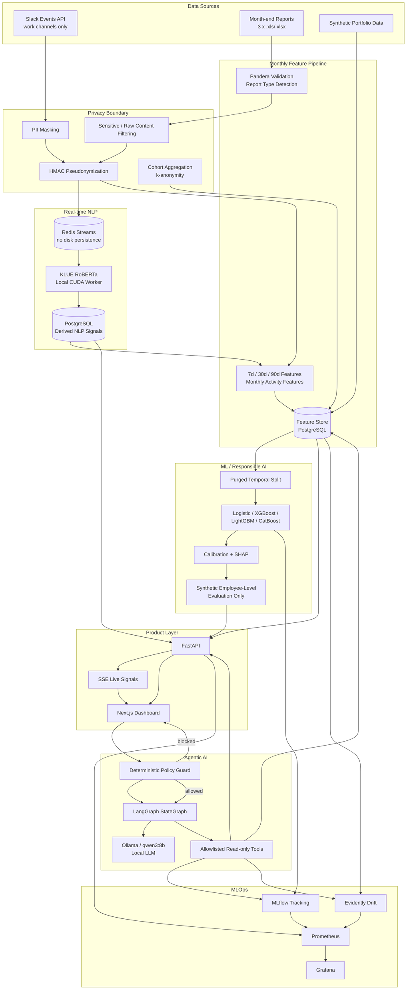

# PeoplePulse AI — Final Architecture

## 1. End-to-End Architecture

## 2. Trust Boundaries

| Boundary | Rule |
|---|---|
| Slack raw text | Transient processing only; not durably stored |
| Redis | Persistence disabled for transient masked message payloads |
| Identifiers | HMAC pseudonymization before durable analytics storage |
| Browser/report content | Raw URL path/query, search text and document names are not exposed to the Analyst |
| Production analytics | Department/cohort level only; minimum cohort suppression |
| Employee-level ML | Synthetic portfolio data only |
| Agent | No arbitrary SQL; only allowlisted read-only tools |
| Employment decisions | Hiring, firing, promotion, discipline and compensation recommendations blocked |
| Health inference | Workplace NLP signals are not used for mental-health diagnosis |

## 3. Deployment Topology

- **Windows host:** Ollama + NVIDIA GPU NLP worker when CUDA is needed.
- **Docker Compose:** PostgreSQL, Redis, FastAPI, Next.js, MLflow, Evidently worker, Prometheus and Grafana.
- **Local-only default:** no required paid LLM/cloud API.
- **One-command demo:** `./scripts/portfolio_up.ps1 -Scope synthetic_demo`.

## 4. Why this architecture

1. **Separation of raw and derived data** reduces privacy exposure.
2. **Streaming and batch paths are independent** but converge in one feature store.
3. **Temporal ML validation** avoids random-split leakage for future attrition targets.
4. **Calibration and monitoring** separate ranking quality from probability reliability and production health.
5. **Agent tools are domain APIs, not SQL generation**, reducing prompt-injection and data-access risk.
